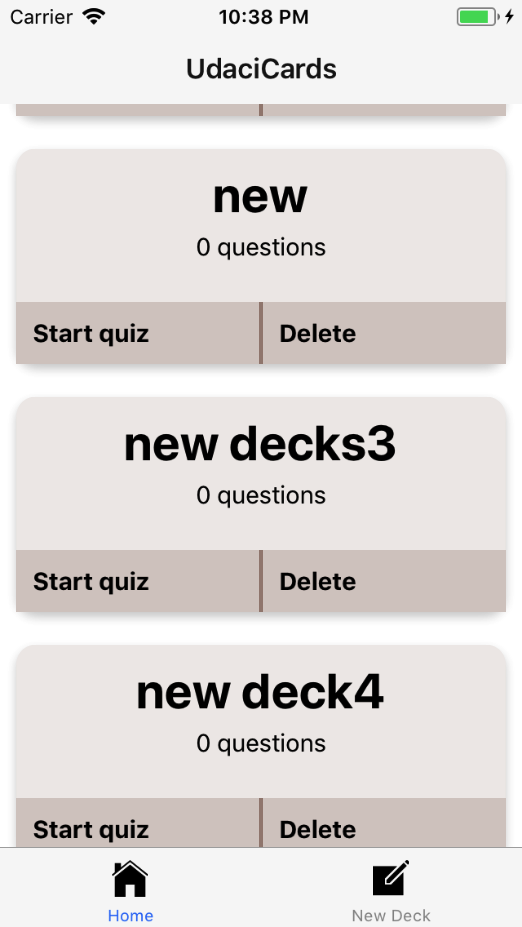
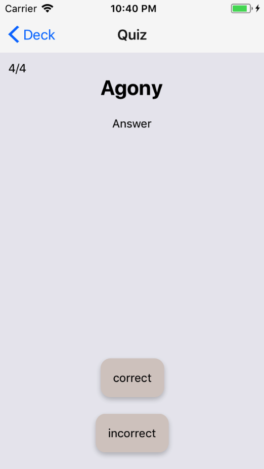
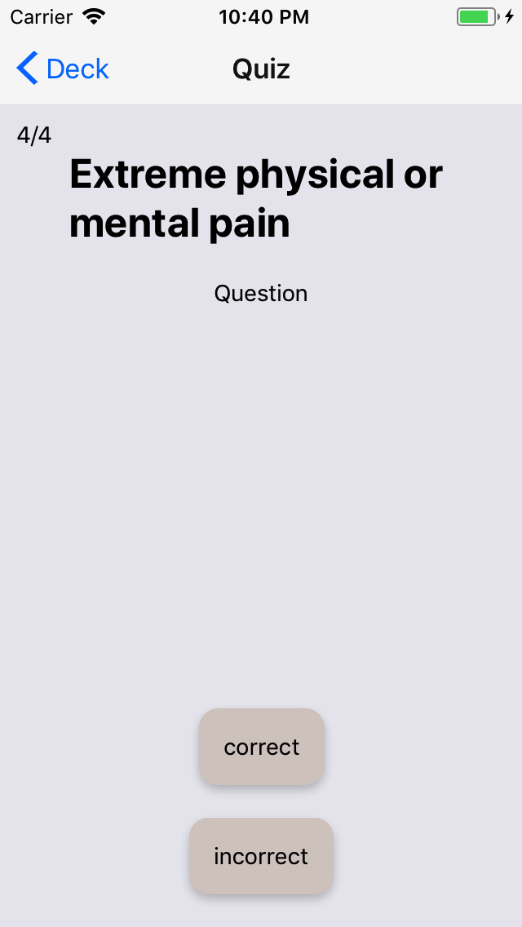
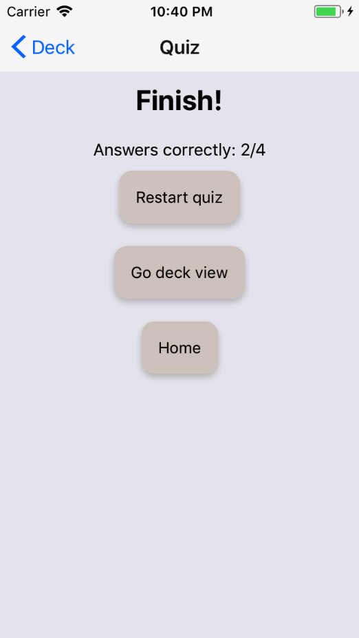

# UdaciCards
A card-quiz application made with react native. Built for ios (not yet tested in Android).

In this app, a user can see the list of card the user made, create a new card and quiz themselves. In addition, the app will remind the user if they have not studied the flash cards on that day.







## Installation

If Yarn was installed when the project was initialized, then dependencies will have been installed via Yarn, and you should probably use it to run these commands as well. Unlike dependency installation, command running syntax is identical for Yarn and NPM at the time of this writing.

### `npm start`

Runs your app in development mode.

Open it in the [Expo app](https://expo.io) on your phone to view it. It will reload if you save edits to your files, and you will see build errors and logs in the terminal.

Sometimes you may need to reset or clear the React Native packager's cache. To do so, you can pass the `--reset-cache` flag to the start script:

```
npm start -- --reset-cache
# or
yarn start -- --reset-cache
```


## License:
Popular movie application was created by Juan Karsten in 2017-2018. It is a free software and may be distributed under MIT License.
